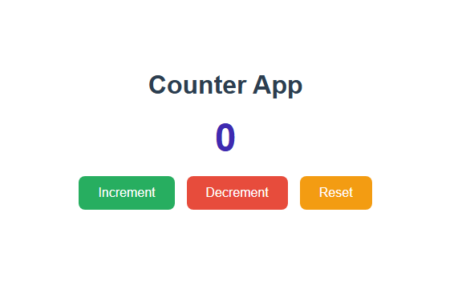

# 🔢 Angular Counter App

---

A simple **Counter App** built using **Angular**.
Click the buttons to increase, decrease, or reset the counter. The counter value **cannot go below 0**.

---

## 🚀 Features
- ✅ Increase counter by 1
- ✅ Decrease counter by 1 (minimum value 0)
- ✅ Reset counter to 0
- ✅ Interactive and responsive Angular UI

---

## 🛠️ Tech Stack
- **Frontend:** Angular 17
- **Language:** TypeScript, HTML, SCSS

---

## ⚡ How It Works
- **Increase:** Adds 1 to the current counter value.
- **Decrease:** Subtracts 1 from the current counter value (stops at 0).
- **Reset:** Sets the counter value back to 0.

---

## 📸 Screenshot

---

## 🚀 Author
 **Safeeya Munawwar**
 

  
  
  
  

---

© 2025 Angular Counter App | Built with ❤️ using Angular

